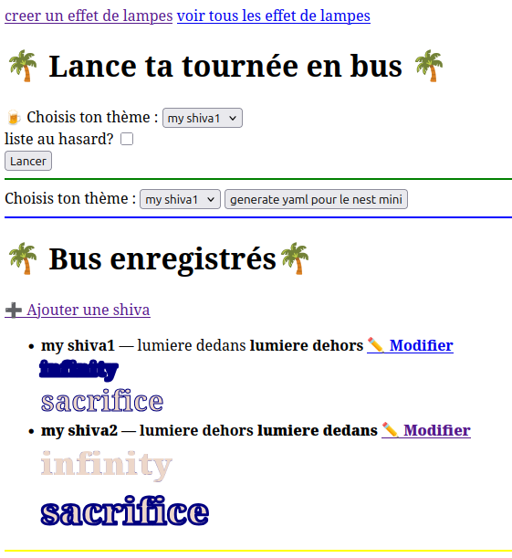
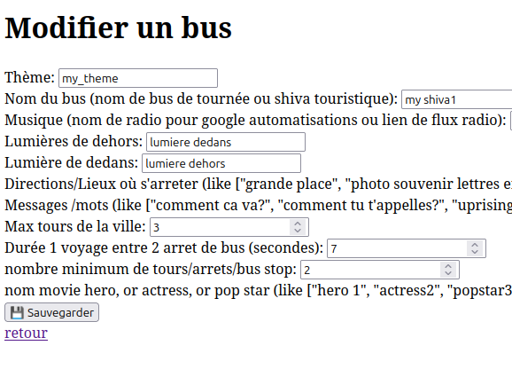

# bienvenue a bus touristique

- pour faire marcher ce bus avec lampes : tu auras besoin d'une ampoule connectée, wifi, d'une enceinte connectée
- créer un nouveau bus et embarque pour un super voyage

- choisis la lumiere dedans, dehors, la musique ou radio, les arrets, et tes messages favoris dans le bus

- execute python script pour faire gym en musique avec scenes assistant vocal
# assistant-vocal-led-music-gym
- python 3 app
- python3 -m http.server 8000
- autre : python3 app.py
- autre : python3 lumiere_ws_controller
- python3 dbseances
- ajoute des motifs du bus, ou un crazy lettering
 - tu peux faire "grep -r -i flux_led.WifiLedBulb" pour trouver là ou modifier l'IP de la lampe

:enjoy:

